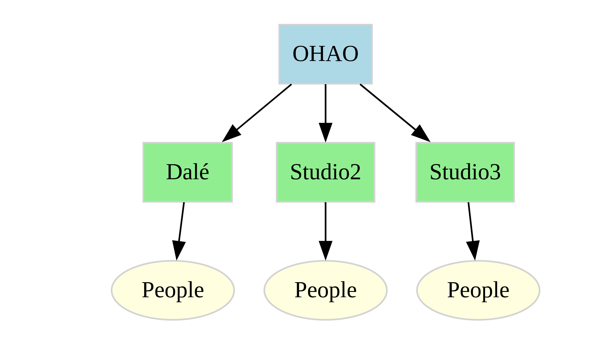

# OHAO.TECH

Welcome to the GitHub profile of **OHAO.TECH**, a startup focused on innovation in technology through a unique organizational structure and collaborative environment.

## About Us

OHAO.TECH is structured like a tree, with OHAO as the root node from which various studios branch out as child nodes. This allows for a flexible, creative, and passion-driven approach to project development.

## Organizational Structure

- **Root Node:** OHAO
- **Studios:** Currently hosting one studio:
  - **Dalé Studio**: Specializes in AI and Gaming Software Development, with a focus on a gamified LLM (Large Language Model) application.

## Operational Mode

We operate under a **Founder Mode**, similar to companies like Airbnb, where the founder leads all operations but encourages open collaboration. This mode promotes:

- **Creativity and Autonomy:** Team members are encouraged to work on projects they are passionate about or start their own studios within OHAO.TECH.
- **Diversity in Business:** Fostering a wide range of innovative projects.

## Financial Structure

- **Profit Sharing:** Upon profitability, 15% of studio profits are shared for management costs and other organizational needs, ensuring a win-win for all contributors.

## Benefits

1. **Shared Profit:** Encourages teamwork and collective success through a 15% profit share.
2. **Mutual Assistance:** Studios support and learn from each other, enhancing growth.
3. **Diversity:** Encourages varied business ventures, attracting a broad spectrum of creators and enthusiasts.

## Current Projects

- **Dalé Studio** is currently in the development phase of a gamified LLM app, seeking collaborators with interests in AI and gaming.

## Join Us

We are in the early stages, with no current products or revenue, but our vision is to develop successful projects that will sustain our community. If you are passionate about technology, AI, gaming, or have an innovative idea, join us to help shape the future of OHAO.TECH.

- **Contribute:** Interested individuals can join existing projects or propose new studio ideas.
- **Collaborate:** Share your skills, learn from others, and grow with us.

## Contact

For collaboration or inquiries, feel free to reach out:

- **GitHub:** [@Qervas](https://github.com/Qervas/)
- **Email:** [Frank Yin](djmax96945147@outlook.com)

## Copyright

All content, code, and projects under OHAO.TECH are © [2025] OHAO.TECH. All rights reserved. Unauthorized use, reproduction, or distribution is strictly prohibited. For commercial use or licensing inquiries, please contact us.

---

Thank you for visiting the OHAO.TECH GitHub profile. We look forward to building innovative technology solutions together!
